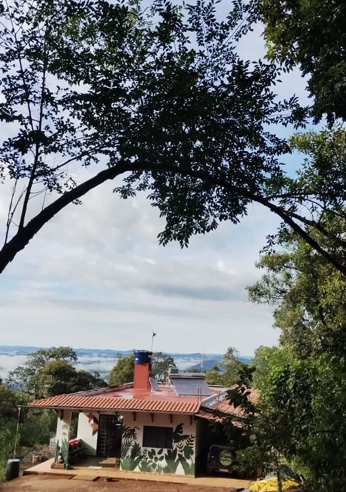

# 🌱 CEA Mandembo - Plataforma Educativa Casa12Volts®

<div align="center">



**Plataforma Web Educativa**

Centro de Educação Ambiental Mandembo

[](https://cea-mandembo.vercel.app)
[](https://react.dev/)
[](https://www.typescriptlang.org/)
[](https://vitejs.dev/)

[🚀 Ver Demo](https://cea-mandembo.vercel.app) • [📖 Documentação](#-estrutura-do-projeto) • [🎯 Objetivos](#-objetivos-de-desenvolvimento-sustentável)

</div>

---

## 🌍 Sobre o Projeto

Esta plataforma web educativa foi desenvolvida em parceria com o **Centro de Educação Ambiental Mandembo**.

O projeto tem como objetivo **democratizar o conhecimento sobre energias renováveis** através da **Casa12Volts®**, primeira residência multivolts do Brasil operando 100% em corrente contínua (1,5V, 3V, 5V, 12V, 19V e 24V).

### 🎯 Objetivos Gerais

- ✅ Educar sobre **eficiência energética** e **energias renováveis**
- ✅ Demonstrar **viabilidade técnica** de sistemas off-grid
- ✅ Promover **consciência ambiental** através da tecnologia
- ✅ Fornecer **ferramentas interativas** de aprendizado
- ✅ Contribuir para os **ODS 7 e 13** da ONU

## 📊 Dashboard Educativo Casa12Volts®

### 🎯 Objetivo do Projeto

Desenvolver um **dashboard web interativo** que permita visualizar, em tempo real, os dados de geração e consumo de energia da Casa12Volts®, facilitando a compreensão sobre sistemas de energia renovável.

### 📌 Funcionalidades

#### 1️⃣ Visualização de Dados em Tempo Real

- **Geração Solar**: Monitoramento de painéis fotovoltaicos
- **Geração Eólica**: Dados de turbina eólica
- **Pedal Sustentável**: Energia gerada por esforço humano
- **Consumo Total**: Uso energético em tempo real

#### 2️⃣ Componentes Detalhados

- Visualização de **todos os componentes** do sistema
- Especificações técnicas de cada equipamento
- Status de funcionamento

#### 3️⃣ Métricas de Sustentabilidade

- **CO₂ Evitado**: Cálculo de emissões evitadas
- **Eficiência Energética**: 92% de aproveitamento
- **Autonomia**: 100% off-grid

### 🛠️ Tecnologias Utilizadas

{
"frontend": ["React 18", "TypeScript", "CSS Modules"],
"visualização": ["Recharts", "React Icons"],
"build": ["Vite", "ESLint"]
}

### 📂 Estrutura

```
src/projects/pex-iv/
├── pages/
│ ├── DashboardHome.tsx # Página principal do dashboard
│ └── ComponentsDetail.tsx # Detalhes dos componentes
├── components/
│ ├── GenerationCard.tsx # Card de geração
│ ├── ConsumptionCard.tsx # Card de consumo
│ └── EfficiencyGauge.tsx # Medidor de eficiência
└── data/
└── mockData.ts # Dados simulados
```

### 🎓 Aprendizado Proporcionado

- 📈 **Visualização de Dados**: Gráficos interativos
- ⚡ **Sistemas de Energia**: Compreensão prática
- 🌱 **Sustentabilidade**: Impacto ambiental quantificado
- 💻 **Tecnologia Web**: React e TypeScript


## ⚖️ Comparador Energético Interativo

### 🎯 Objetivo do Projeto

Criar uma **ferramenta interativa** que permita ao usuário comparar o consumo energético, custos (CEMIG) e impacto ambiental entre sistemas de **12V CC (corrente contínua)** e **110V/220V CA (corrente alternada)**.

### 📌 Funcionalidades

#### 1️⃣ Seleção de Aparelhos

- **Catálogo Completo**: 20+ aparelhos domésticos
- **Categorias**: Iluminação, Refrigeração, Entretenimento, etc.
- **Dados Técnicos**: Consumo em 12V CC e 110V/220V CA

#### 2️⃣ Personalização de Uso

- **Quantidade**: Ajuste de quantidade de cada aparelho
- **Horas/dia**: Personalização de tempo de uso
- **Perfis Pré-definidos**: Básico, Padrão, Completo

#### 3️⃣ Comparação Detalhada

- **Consumo Energético**: kWh/mês em ambos os sistemas
- **Custo CEMIG**: Cálculo baseado em tarifa real
- **Impacto Ambiental**: CO₂ emitido e evitado
- **Eficiência**: Comparação de perdas energéticas

#### 4️⃣ Resultados Visuais

- **Gráficos Comparativos**: Consumo lado a lado
- **Economia Estimada**: Valores em R$ e %
- **Payback**: Tempo de retorno do investimento

### 🛠️ Tecnologias Utilizadas

{
"frontend": ["React 18", "TypeScript", "CSS Modules"],
"estado": ["Zustand / Context API"],
"validação": ["Zod"],
"build": ["Vite", "ESLint"]
}

### 📂 Estrutura

```
src/projects/pex-v/
├── pages/
│ └── ComparatorHome.tsx # Página principal do comparador
├── components/
│ ├── ApplianceSelector.tsx # Seletor de aparelhos
│ ├── ResultsDisplay.tsx # Exibição de resultados
│ └── ComparisonChart.tsx # Gráfico de comparação
├── data/
│ ├── appliancesData.ts # Banco de dados de aparelhos
│ ├── presetProfiles.ts # Perfis pré-definidos
│ └── helpers.ts # Funções de cálculo
└── types/
└── pex-v.types.ts # Tipos TypeScript
```

### 🎓 Aprendizado Proporcionado

- 💡 **Eficiência Energética**: Comparação prática
- 💰 **Economia Doméstica**: Custos reais
- 🌍 **Consciência Ambiental**: Impacto quantificado
- 🔬 **Análise Crítica**: Tomada de decisão informada

## ✨ Funcionalidades Gerais da Plataforma

### 🏠 Página Inicial

- Apresentação do CEA Mandembo
- Informações sobre Casa12Volts®
- Navegação para projetos
- Alinhamento com ODS 7 e 13

### 📱 Responsividade

- ✅ **Desktop**: Layout otimizado para telas grandes
- ✅ **Tablet**: Adaptação para médias resoluções
- ✅ **Mobile**: Interface otimizada para smartphones

### ♿ Acessibilidade

- ✅ Suporte a **leitores de tela**
- ✅ **Alto contraste** para deficiência visual
- ✅ **Redução de movimento** para sensibilidade
- ✅ Navegação por **teclado**

### 🎨 Design System

- Paleta de cores **verde sustentável**
- Tipografia **legível e moderna**
- Componentes **reutilizáveis**
- **Dark mode** automático

## 🛠️ Tecnologias Utilizadas

### Frontend

- **React 18.3**: Biblioteca JavaScript
- **TypeScript**: Tipagem estática
- **Vite**: Build tool moderna
- **React Router v6**: Roteamento SPA

### Estilização

- **CSS Modules**: Escopo local
- **CSS Custom Properties**: Temas dinâmicos
- **Flexbox/Grid**: Layout responsivo

### Qualidade de Código

- **ESLint**: Análise estática
- **Prettier**: Formatação automática
- **TypeScript Strict Mode**: Segurança de tipos

### Deploy

- **Vercel**: Hospedagem e CI/CD
- **Git**: Controle de versão
- **GitHub**: Repositório remoto

## 📁 Estrutura do Projeto

```
cea-mandembo/
├── public/
│ ├── assets/
│ │ └── images/
│ │ └── casa12volts-hero.jpg
│ ├── logo_tab_mandembo.svg
│ └── index.html
├── src/
│ ├── components/
│ │ ├── common/
│ │ │ ├── Header.tsx
│ │ │ ├── Footer.tsx
│ │ │ └── Button.tsx
│ │ └── layout/
│ │ └── MainLayout.tsx
│ ├── pages/
│ │ ├── Home.tsx
│ │ ├── About.tsx
│ │ └── NotFound.tsx
│ ├── projects/
│ │ ├── pex-iv/ # Dashboard Educativo
│ │ └── pex-v/ # Comparador Energético
│ ├── utils/
│ │ ├── constants.ts
│ │ └── helpers.ts
│ ├── App.tsx
│ ├── router.tsx
│ └── main.tsx
├── package.json
├── tsconfig.json
├── vite.config.ts
├── vercel.json
└── README.md
```

## 🚀 Como Executar o Projeto

### Pré-requisitos

- **Node.js** 18+ ([Download](https://nodejs.org/))
- **npm** ou **yarn**
- **Git** ([Download](https://git-scm.com/))

### Instalação

1. Clone o repositório
   git clone https://github.com/seu-usuario/cea-mandembo.git

2. Entre na pasta
   cd cea-mandembo

3. Instale as dependências
   npm install

4. Execute em desenvolvimento
   npm run dev

5. Acesse no navegador a url gerada com a inicial "http://localhost:"...

### Build para Produção

#### Gerar build otimizada

npm run build

#### Testar build localmente

npm run preview

### Deploy

O projeto está configurado para **deploy automático** na Vercel via GitHub.

---

## 🎯 Objetivos de Desenvolvimento Sustentável

Este projeto contribui para os seguintes ODS da ONU:

### ODS 7 - Energia Limpa e Acessível

- ⚡ Demonstração de **energia renovável** viável
- 🌞 Sistemas **solar** e **eólico** integrados
- 💪 Geração por **esforço humano** (Pedal Sustentável)
- 📚 **Educação** sobre eficiência energética

### ODS 13 - Ação Contra a Mudança Global do Clima

- 🌍 Redução de **emissões de CO₂**
- ♻️ Promoção de **energia limpa**
- 📊 **Quantificação** de impacto ambiental
- 🎓 **Conscientização** sobre sustentabilidade

---

## 👨‍💻 Autor

**Daniel Pedersoli Moreira Santos**  
Desenvolvedor Fullstack

**Projetos de Extensão**:

- 📊 Dashboard Educativo Casa12Volts®
- ⚖️ Comparador Energético Interativo

**Contato**:

- 🔗 [LinkedIn](https://www.linkedin.com/in/danielpedersoli-frontend-developer/)
- 💼 [GitHub](https://github.com/dpedersoli)
- 📧 [Email](dpmsengineer@gmail.com)

---

## 📄 Licença

Este projeto é de **uso educacional**.

**Parceria**: Centro de Educação Ambiental Mandembo  
**Ano**: 2025

---

## 🙏 Agradecimentos

- **CEA Mandembo**: Parceria e disponibilização da Casa12Volts®
- **Comunidade**: Feedback e contribuições

---

<div align="center">

**Desenvolvido com 💚 para um futuro mais sustentável**

🌱 CEA Mandembo | Casa12Volts® | 2025

</div>
